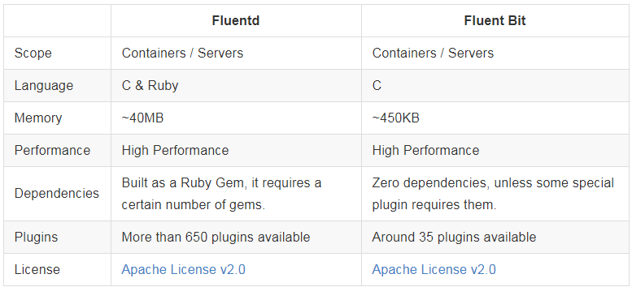
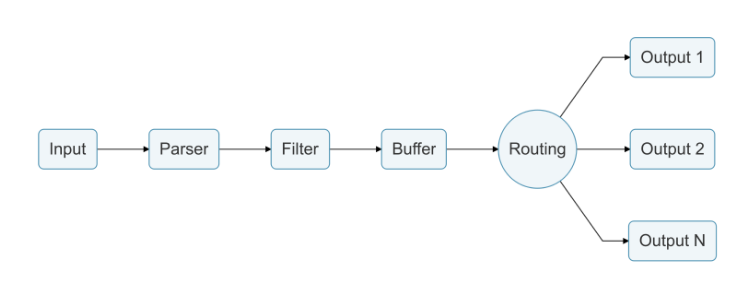

# Fluentd & Fluent-bit

Fluentd 和 Fluent-bit 都是开源数据收集工具,官方的比较如下:

目前比较主流的日志收集架构是使用filebeat + logstash, 从测试性能来看无论是 fluentd 和 fluent-bit性能都比 logstash 要优秀很多。

我们也可以使用 fluent-bit + fluentd 来实现 日志数据格式化、过滤、存储到ES的功能, 从实际使用情况来看, flient-bit 和 fluentd的配置更加人性化,官方的文档说明也更Easy。

## Fluent-bit 执行过程

